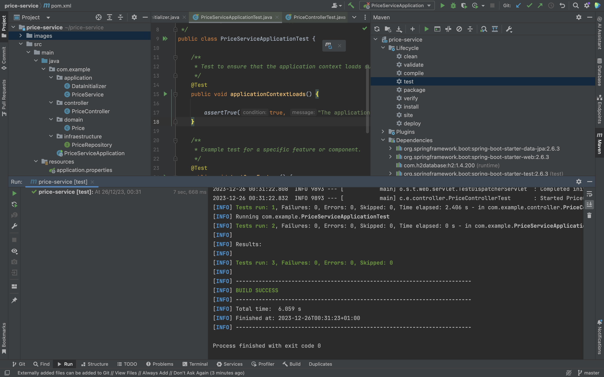

# Prueba Java SpringBoot

## Comenzando 🚀

_Estas instrucciones te permitirán obtener una copia del proyecto en funcionamiento en tu máquina local para propósitos de desarrollo y pruebas._

### Pre-requisitos 📋
_Se debe tener instalado docker_
_Se ha creado un docker file que incluye maven_
_Se debe de ejecutar los siguientes comandos_

Para construir la imagen docker java-maven
```
docker build -t java-maven .
```
Para ejecutar la imagen docker java-maven
```
docker run -p 8080:8080 java-maven 
```
### Estructura del proyecto
La estructura se basa en la arquitectura hexagonal.


### Prueba en el postman

### Prueba de que los test funcionan



